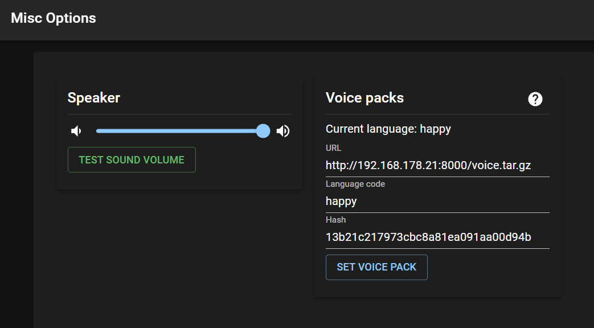

# Mi Robot Vacuum-Mop Xiaomi 1C (STYTJ01ZHM) Audio

Create TTS audio files from `transcripts.csv` and package them for the Mi Robot Vacuum-Mop Xiaomi 1C (STYTJ01ZHM).

## Prerequisites
- Python 3.10+ (Windows PowerShell examples below)
- Google Cloud Text-to-Speech API key
- ffmpeg on PATH (required for `mp3`/`ogg`)
  - Windows install: `winget install ffmpeg`

## Setup
1. Edit `transcripts_original.csv` as needed, then export/update `transcripts.csv`.
2. Create and activate the virtual environment:
   ```powershell
   python -m venv tts-env
   .\tts-env\Scripts\Activate.ps1
   pip install -r requirements.txt
   ```

## Generate voices
Basic run (OGG output with ffmpeg):
```powershell
python.exe .\generate.py --api-key "ABC-DEF" --csv "transcripts.csv" --use-ffmpeg --format ogg --delete-original-wav
```

## CSV format
`transcripts.csv` must include a header row with at least:
- `id` (unique identifier used for filenames)
- `ssml` (the SSML text to synthesize)

Example:
```csv
id,ssml
1,"<speak>Hello there.</speak>"
2,"<speak>Battery low. Please charge.</speak>"
```

## generate.py configuration examples
Minimal WAV (no ffmpeg):
```powershell
python.exe .\generate.py --api-key "ABC-DEF" --csv "transcripts.csv" --format wav
```

MP3 output (ffmpeg required, keep intermediate WAV):
```powershell
python.exe .\generate.py --api-key "ABC-DEF" --csv "transcripts.csv" --use-ffmpeg --format mp3
```

OGG output and delete intermediate WAV:
```powershell
python.exe .\generate.py --api-key "ABC-DEF" --csv "transcripts.csv" --use-ffmpeg --format ogg --delete-original-wav
```

Only regenerate specific IDs:
```powershell
python.exe .\generate.py --api-key "ABC-DEF" --csv "transcripts.csv" --ids "12,15,42"
```

Custom output folder, columns, and voice:
```powershell
python.exe .\generate.py --api-key "ABC-DEF" --csv "transcripts.csv" --outdir "out_audio" --id-col "id" --ssml-col "ssml" --voice "en-GB-Chirp3-HD-Leda" --lang "en-GB"
```

## Package voices
Run from Linux or WSL:
```bash
./package_voices.sh
```

## Serve and connect
Valetudo should already be installed on the robot.

Back on Windows, start a local server:
```powershell
python.exe -m http.server 8000 --bind 0.0.0.0
```

Connect to Valutedo and follow the image guide:



You should now have the new voices.

## References
We used these references during setup:
- Supported robots page: https://valetudo.cloud/pages/general/supported-robots.html#xiaomi_1c
- Manual install notes: https://gist.github.com/stek29/5c44244ae190f3757a785f432536c22a

## Documentation
- `documentation/dreame_1c_root.md`

Manual install that was required:
```bash
./install-manual.sh
./install.sh
```

## Troubleshooting
- `ffmpeg not found on PATH`: install with `winget install ffmpeg`, then open a new PowerShell and run `ffmpeg -version`.
- `For mp3/ogg, you must pass --use-ffmpeg`: add the `--use-ffmpeg` flag for `--format mp3` or `--format ogg`.
- `TTS failed (403/401)`: API key is missing, invalid, or the Text-to-Speech API is not enabled for the project.
- `CSV not found`: confirm the `--csv` path and current working directory.
- `Missing id column` / `Missing SSML column`: ensure the header row matches `--id-col` and `--ssml-col`.
